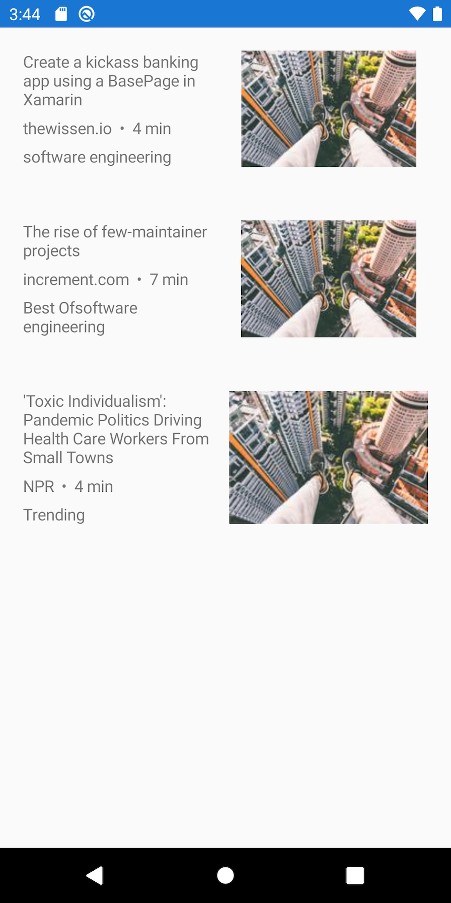

# Xamarin Material Design Visual Challenge

The purpose of this repo is to complete the [Xamarin Material Design Visual challenge](https://devblogs.microsoft.com/xamarin/visual-challenge-conquered/).

## Challenges

### 1. Pocket

Original | Android | iOS
--- | --- | ---
 |  | 

### 2. Lyft

Original | Android | iOS
--- | --- | ---
 |  | 

### 3. Weather (iPhone app)

Original | Android | iOS
--- | --- | ---
 |  | 

## Notes

- At first I questioned the value of this challenge
- I'm not that good at frontend styling, why should I invest time in this?
- But after doing three apps, I realized that repetition is the key to getting good at frontend styling
